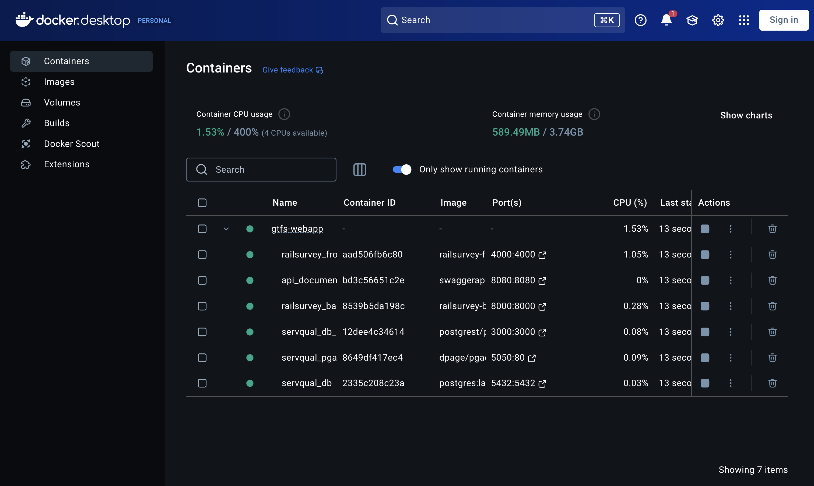
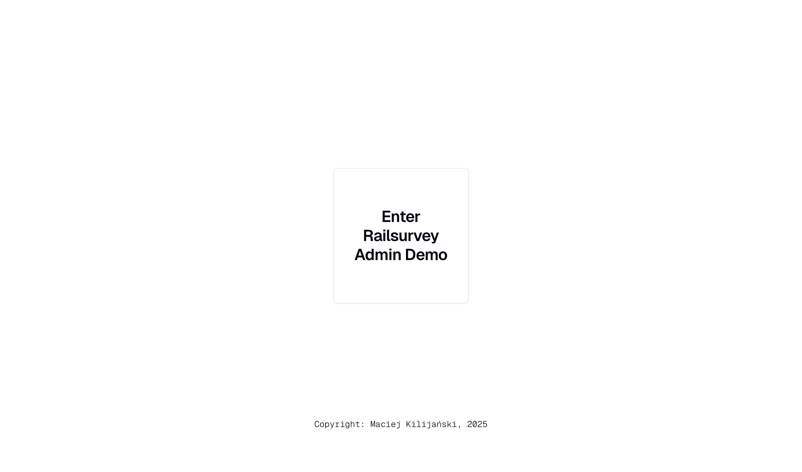
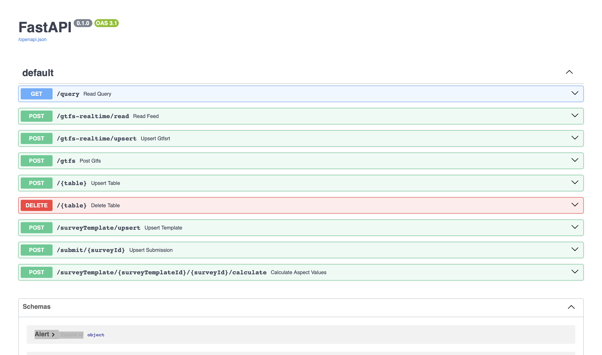
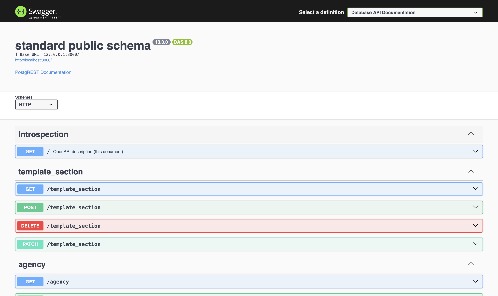

# Instructions

Welcome to the Railsurvey repository! This `Readme` file will guide you through the process of starting the application up on your device.

## Setup process

### 1. Download Docker and Docker Compose

Install [Docker](https://docs.docker.com/get-docker/) and [Docker Compose](https://docs.docker.com/compose/install/) on your device. These tools are required to build and run the application containers.

---

### 2. Fork or download this repository

Clone the repository to your local machine with an IDE (Integrated Development Environment) like **VS Code** or Git command in your machine's terminal:

```sh
git clone https://github.com/mackili/gtfs-webapp.git
```

Or download it as a `.zip` file and extract it to a folder of your choice.

Copy the path in which the repository is saved on your device. You will need it in the next steps.

#### Optional: change environment variables:

In the [`docker-compose.yaml`](./docker-compose.yaml) file you can set the environment variables which reflect credentials and certain setting of the application.

**It is strongly recommended to only change the variables if you are an advanced user and have reviewed the code and documentation.**

---

### 3. Build and start Docker images with Docker Compose

Open your device's terminal.
Navigate to the project root directory (where `docker-compose.yaml` is located, i.e. the main folder of this repository) using the `cd` command:

```sh
# Replace <path-to-local-repository-folder> with your repository location
cd "<path-to-local-repository-folder>"
```

```sh
# example:
cd "/Users/username/Documents/gtfs-webapp"
```

Build and start all services with:

```sh
# Replace <your-service-name> with your desired project name
docker compose -p <your-service-name> up --build -d
```

```sh
# Example:
docker compose -p railsurvey up --build -d
```

This command will build all custom images (for backend and frontend) based on provided `Dockerfile` files and pull necessary official Docker images for PostgreSQL, pgAdmin, PostgREST, and Swagger UI.

It will also launch all containers as defined in `docker-compose.yaml`:

-   PostgreSQL database on port `5432`
-   pgAdmin on port [`5050`](http://localhost:5050)
-   PostgREST API on port `3000`
-   Swagger UI documentation on port [`8080`](http://localhost:8080)
-   Backend service on port [`8000`](http://localhost:8000/docs)
-   Frontend service on port [`4000`](http://localhost:4000)

You can access each of them by navigating to `http://localhost:<port-number>`.

All services will be networked together and ready for use.

---

### 4. Navigate to your Docker desktop application

You should now see a Docker Compose stack running with links to the services in the application:



Upon clicking on ports hyperlink, you'll be redirected to the chosen service:

#### Railsurvey frontend redirect:



#### Python backend API specification:



#### Postgrest specification:


